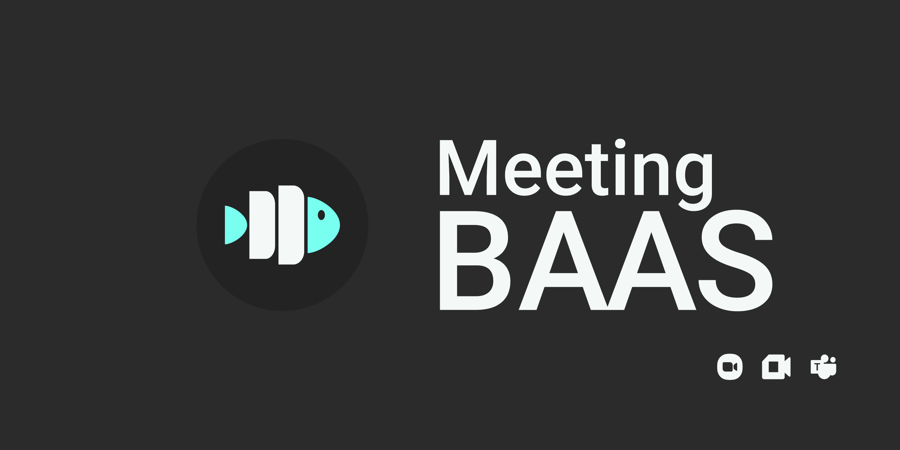

# Meeting Baas 🐟 Integration Examples

Using [Meeting Baas' API](https://meetingbaas.com/) and open-source examples, this repository contains programs that either:

1. Send Meeting Bots to [Google Meet](https://meet.google.com/), [Zoom](https://zoom.us/) and [Microsoft Teams](https://www.microsoft.com/en-us/microsoft-teams/log-in) in an easy way.

2. Automate :
    - data extraction from meetings and conversations via LLM
    - index specific data, and make it easily searchable, retriavable and viewable.

## Available Setups

Examples are divided in 2:

1. **Stand-alone examples using code** which include:
    - How to send a bot in different fashions (through a calendar API, a Chrome extension, a form, ...)
    - How to handle the data, present it, search inside it, ...

2. **Integrations using third-party software**, whether said software is open-source or not. So of course [make.com](https://make.com/), [n8n.io](https://n8n.io/) integrations, but also a Google Calendar form to invite a bot to meeting to record it which you can share with a team, ...

## Apps & Data-Handling

Learn how to invite meeting bots to a meeting for yourself or your users, and view examples to start handling the data quickly.

**[Transcript Player Interface](./apps/player-interface/)**
- This project is a web application that displays a video player with a synchronized transcript. The interface is divided into two main parts: the video player and the transcript.
- Technologies used: Node, React, Typescript, Chakra.

**[Desktop App to invite a bot](./apps/rust-send-bots-form/)**
- A cross-platform desktop application with a simple user-input form to send Meeting Bots to [Zoom](https://zoom.us/), [Google Meet](https://meet.google.com/), or [Microsoft Teams](https://www.microsoft.com/en-us/microsoft-teams/log-in) meetings.
- Technologies used: Rust, Tauri, HTML, Javascript.

**[WebApp and Server to record and handle data](./apps/node-js-to-notion-llm-brief/)**
- A simple web app that:
  - Has a simple sharable page to send a meeting bot.
  - Has an automation process to summarize meeting transcriptions with [OpenAI](https://openai.com/) and publish formatted information to a [Notion](https://www.notion.so/) DataBase, with meta-data.
- Technologies used: ExpressJS, Node.
- Third-parties used: [OpenAI](https://openai.com/), [Notion](https://www.notion.so/).

**[Talking Blob](./apps/rust-talking-blob/)**
- Slightly off-topic: an animated blob packaged a desktop app. It simply reacts to microphone input :)
- Technologies used: Node, React, ThreeJS, Rust, Tauri.

## Automations relying on third-party software

Automate data extraction from [Google Meet](https://meet.google.com/), [Microsoft Teams](https://www.microsoft.com/en-us/microsoft-teams/log-in), and [Zoom](https://zoom.us/) using third party, "no-code" software.

**[View n8n Example](./to-other-apps/meeting-to-notion-with-n8n/)**
- Automate meeting transcription and [Notion](https://www.notion.so/) sync using [n8n's](https://n8n.io/) visual workflow editor and the [Meeting Baas API](https://doc.meetingbaas.com/).

**[View Make Example](./to-other-apps/meeting-to-airtable-with-make/)**
- Sync meeting transcriptions to Airtable using [Make's](https://make.com/) no-code platform and the [Meeting Baas API](https://doc.meetingbaas.com/).

## Contributing && Troubleshooting

Join our [Discord](https://discord.gg/dsvFgDTr6c) if you run into any issues, and ping us there.

Contributions to this repository directly here on Github are welcome.

To contribute:

1. Fork the repository.
2. Create a new branch for your feature or bug fix.
3. Commit your changes, following the established coding standards.
4. Include appropriate documentation for your changes.
5. Submit a pull request, describing your changes in detail.

For any suggestions or enhancements, please open an issue in the repository.
